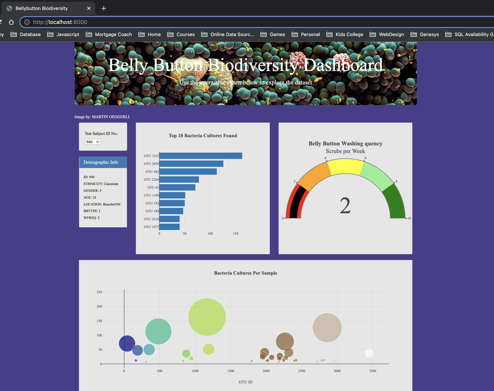

# plotly_deployment
## Overview
For our 12th data analytics project.  We created a dynamic website with graphs using javascript, plotly.js, bootstrap, css, and d3.  The site uses data from a study of types of bacteria living in people's navels.  We built the site such that visitors can look at the results of the study for each participant by their participant id number.  Whenever a new id number is selected, the page will refresh with the study details for that participant.   
## Results
First, the demographic data about the participant is displayed, including age, gender, belly button type, wash frequency, gender, and ethnicity.  Then we created a bar graph to show the top 10 bacteria cultures found in that participants navel.  We created a scatter plot to show the amount of each bacteria type found for each type.  Finally we added a gauge to show the wash frequency per week.  Using bootstrap and css, we added some custom styling to the page as well.  Including styling to account for mobile usage.  

